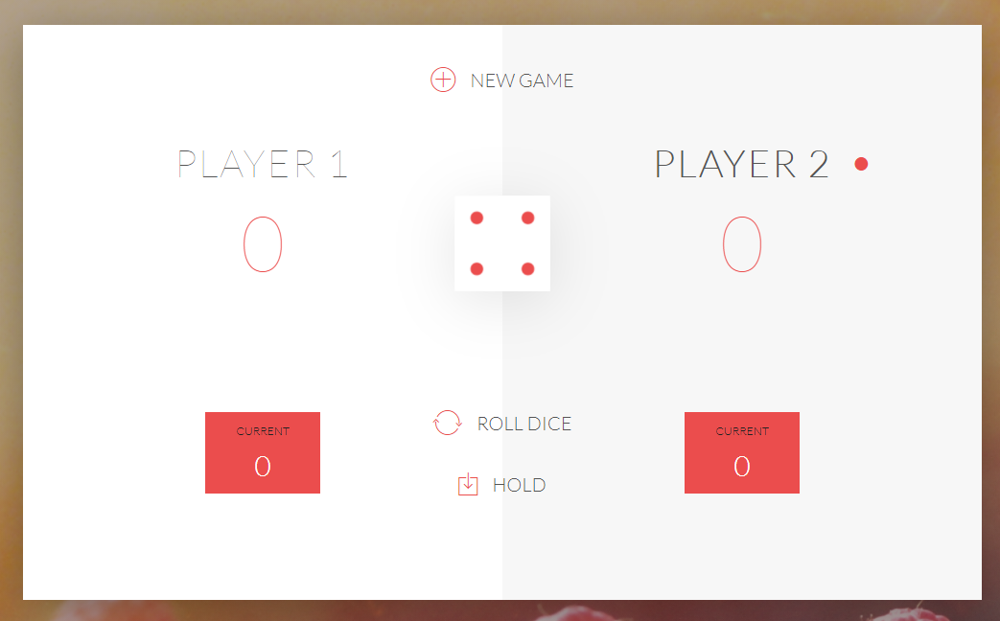

# DOM-pig-game

#### Preview : [Pig-Game](https://itxyousafwebdev.github.io/Bootstrap---Landing-Page/)
     

## Rules
Pig is a simple dice game which in its basic form is playable with just a single die. You win by being the first player to score 100 or more points.

To play you'll need 2 players.

Choose a player to go first. That player throws a die and scores as many points as the total shown on the die providing the die doesn’t roll a 1. The player may continue rolling and accumulating points (but risk rolling a 1) or end his turn.

If the player rolls a 1 his turn is over, he loses all points he accumulated that turn, and he passes the die to the next player.

Play passes from player to player until a winner is determined.

### How do you win?
The first player to accumulate 100 or more points wins the game.
